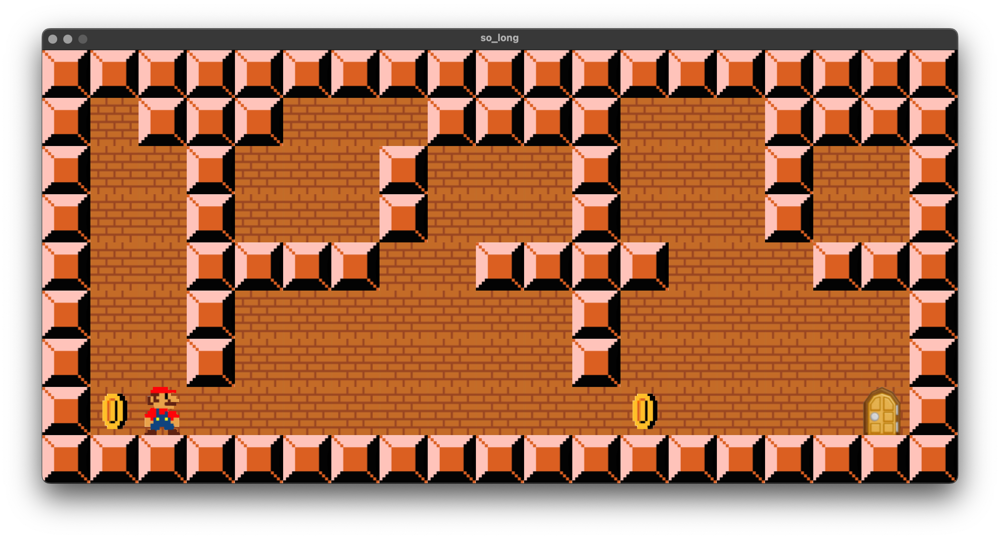

# 🎮 so\_long

**so\_long** is a simple 2D maze game developed as part of the **42 School** curriculum.
Collect all items and reach the exit to win — powered by the lightweight **MLX42** graphics library.

---

## ⚙️ Features

* Load custom `.ber` maps
* Collect items (`C`)
* Reach the exit (`E`) after collecting everything
* Uses modern **MLX42** for graphics
* Keyboard controls: `W`, `A`, `S`, `D`

---

## 🧱 How to Build & Run

### 1. Clone the Project

```bash
git clone https://github.com/mouchtach/so_long.git
cd so_long
```

### 2. Build MLX42

```bash
make mlx
make build
```

> Requires `cmake`, `glfw`, and dependencies installed.

### 3. Build the Game

```bash
make
```

### 4. Run

```bash
./so_long maps/map.ber
```

> Replace with your custom `.ber` map if desired.

---

## 🕹️ Controls

| Key | Action     |
| --- | ---------- |
| W   | Move up    |
| A   | Move left  |
| S   | Move down  |
| D   | Move right |

* Collect all `C` before heading to `E`

---

## 📂 Structure

```
so_long/
├── check/     → Map validation
├── read/      → File & utils
├── game/      → Logic & rendering
├── maps/      → Sample maps
├── so_long.c  → Main file
```

---

## 🖼️ Screenshot



---


## 📝 Notes

* Ensure your map files are valid `.ber` format
* All maps must be closed, rectangular, and valid
* Game won’t start unless map passes validation


